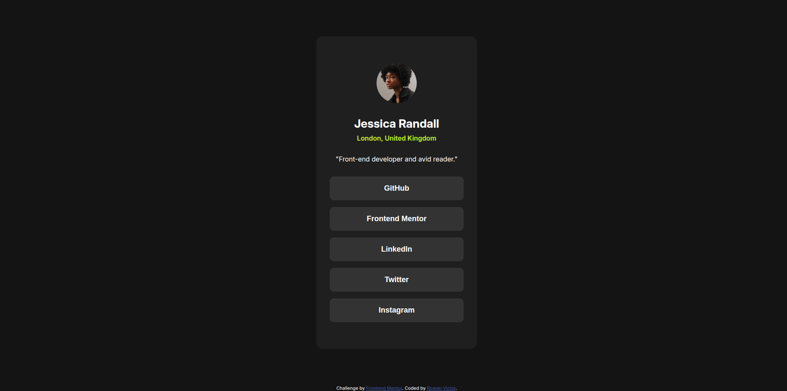

# Frontend Mentor - Social links profile solution

This is my solution to the [Social links profile challenge on Frontend Mentor](https://www.frontendmentor.io/challenges/social-links-profile-UG32l9m6dQ). Frontend Mentor challenges help you improve your coding skills by building realistic projects.

## Table of contents

- [Frontend Mentor - Social links profile solution](#frontend-mentor---social-links-profile-solution)
  - [Table of contents](#table-of-contents)
  - [Overview](#overview)
    - [The challenge](#the-challenge)
    - [Screenshot](#screenshot)
    - [Links](#links)
  - [My process](#my-process)
    - [Built with](#built-with)
    - [What I learned](#what-i-learned)
    - [Continued development](#continued-development)
  - [Author](#author)

## Overview

A simple social links card built with HTML and CSS as a part of Frontend Mentor's Learning Paths Challenges.

### The challenge

Users should be able to:

- See hover and focus states for all interactive elements on the page

### Screenshot

### Links

- [Frontend Mentor Challenge Solution](https://www.frontendmentor.io/solutions/social-links-profile-page-with-css-M9wYN808qK)
- [Live Demo Here](https://rowanvictor01.github.io/social-links-profile/)

## My process

I first built the card and it's structure using HTML. After that I applied basic design and proceeded on making the layout inside the card using `flexbox`. After creating the layout, I proceeded on designing the individual components that make up the card like the image, texts, and buttons. After putting those together, I made sure the components are fluid and responsive by using `clamp()` to have the components adapt to the screen size of the user.

### Built with

- Semantic HTML5 markup
- CSS custom properties
- Flexbox
- Mobile-first workflow

### What I learned

I learned a lot on how to use `clamp()` for basic responsiveness and making components fluid and working with units like `vw` and `rem`.

### Continued development

I'll continue on working with responsive design principles and the use of `clamp()`, `vw`, and `rem`. I'll also continue working on making layouts using `flexbox`.

## Author

- Frontend Mentor - [@rowanvictor01](https://www.frontendmentor.io/profile/rowanvictor01)
- Twitter - [@rowanlearnscode](https://www.x.com/rowanlearnscode)
